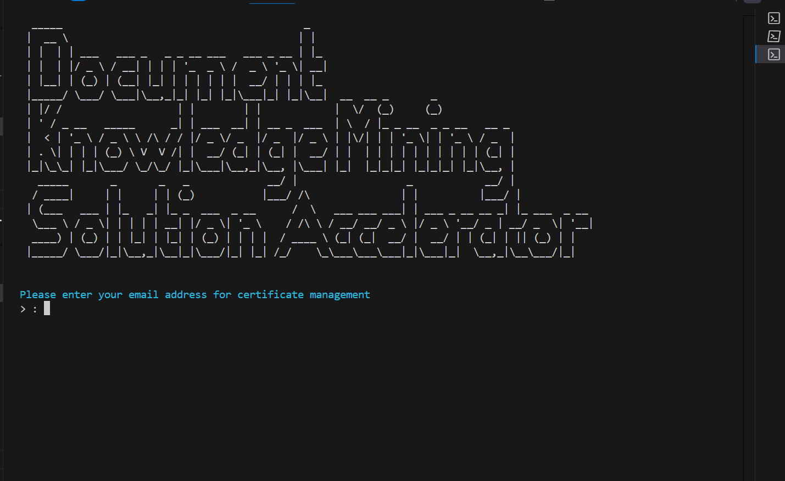
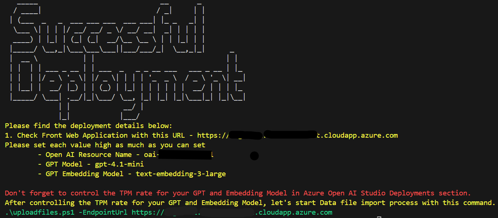
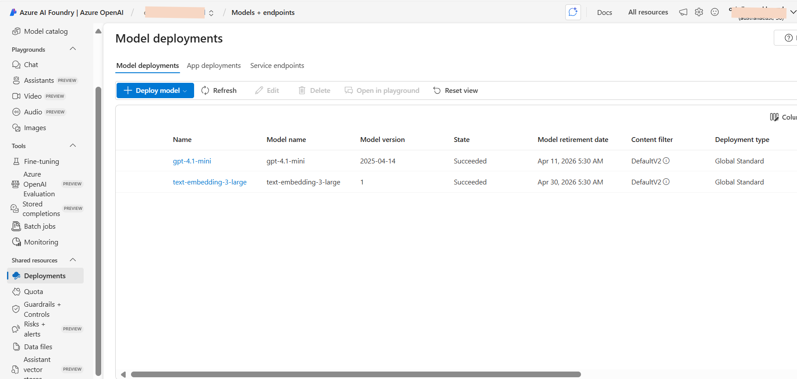

# AVM Post Deployment Guide

> **📋 Note**: This guide is specifically for post-deployment steps after using the AVM template. For complete deployment from scratch, see the main [Deployment Guide](./DeploymentGuide.md).

---

This document provides guidance on post-deployment steps after deploying the Document Knowledge Mining Solution Accelerator from the [AVM (Azure Verified Modules) repository](https://github.com/Azure/bicep-registry-modules/tree/main/avm/ptn/sa/document-knowledge-mining).

## Overview

After deploying the infrastructure using AVM, you'll need to complete the application layer setup, which includes:
- Configuring Kubernetes infrastructure
- Building and deploying container images
- Setting up certificates and ingress controllers
- Configuring application settings

## Prerequisites

Before starting the post-deployment process, ensure you have the following:

### Required Software

1. **[PowerShell](https://learn.microsoft.com/en-us/powershell/scripting/install/installing-powershell?view=powershell-7.4)** <small>(v7.0+ recommended, v5.1+ minimum)</small> - Available for Windows, macOS, and Linux

2. **[Azure CLI](https://learn.microsoft.com/en-us/cli/azure/install-azure-cli)** <small>(v2.50+)</small> - Command-line tool for managing Azure resources

3. **kubectl** - Kubernetes command-line tool  
   Install using Azure CLI:
   ```powershell
   az aks install-cli
   ```

4. **aks-preview extension** - Azure CLI extension for AKS preview features  
   ```powershell
   az extension add --name aks-preview
   ```

5. **[Helm](https://helm.sh/docs/intro/install/)** <small>(v3.0+)</small> - Package manager for Kubernetes

6. **[Docker Desktop](https://docs.docker.com/get-docker/)** - Container platform for building and publishing images
   > ⚠️ **Important**: Ensure Docker Desktop is running before executing the deployment script

### Azure Requirements

7. **Azure Access** - One of the following roles on the subscription:
   - `Owner` 
   - `User Access Administrator`

8. **Microsoft.Compute Registration** - Verify this resource provider is registered:
   1. Navigate to [Azure Portal](https://portal.azure.com)
   2. Go to your **Azure subscription**
   3. Select **Settings** → **Resource Providers**
   4. Search for **Microsoft.Compute** and ensure it's **Registered**
   
   

9. **Deployed Infrastructure** - A successful Document Knowledge Mining Accelerator deployment from the [AVM repository](https://github.com/Azure/bicep-registry-modules/tree/main/avm/ptn/sa/document-knowledge-mining)

## Post-Deployment Steps

### Step 1: Clone the Repository

First, clone this repository to access the post-deployment scripts:

```powershell
git clone https://github.com/microsoft/Document-Knowledge-Mining-Solution-Accelerator.git
```
```powershell
cd Document-Knowledge-Mining-Solution-Accelerator
```

### Step 2: Run the Post-Deployment Script

The post-deployment process is automated through a single PowerShell script that completes the following tasks in approximately 20-30 minutes:

#### What the Script Does:
1. **Configure Kubernetes Infrastructure** - Set up AKS cluster settings and networking
2. **Update Configuration Files** - Generate FQDN, container image paths, and certificate settings
3. **Deploy Kubernetes Components** - Install Cert Manager, Ingress Controller, and application pods
4. **Build and Push Container Images** - Compile and publish application containers to Azure Container Registry
5. **Provide Access Information** - Display the final application URL and next steps

#### Execute the Script:

1. Navigate to the deployment directory:
   ```powershell
   cd .\Deployment\
   ```

2. **Choose the appropriate command based on your deployment method:**

   **If you deployed using custom templates, ARM/Bicep deployments, or `az deployment group` commands:**
   ```powershell
   .\resourcedeployment.ps1 -ResourceGroupName "<your-resource-group-name>"
   ```
   
   **If you deployed using `azd up` command:**
   ```powershell
   .\resourcedeployment.ps1
   ```
   
   > **Note**: Replace `<your-resource-group-name>` with the actual name of the resource group containing your deployed Azure resources.

   > **💡 Tip**: Since this guide is for AVM deployments, you'll most likely use the first command with the `-ResourceGroupName` parameter.

3. **If you encounter execution policy issues**, use this alternative command:
   ```powershell
   powershell.exe -ExecutionPolicy Bypass -File ".\resourcedeployment.ps1" -ResourceGroupName "<your-resource-group-name>"
   ```

### Step 3: Provide Required Information

During script execution, you'll be prompted for:

#### Email Address for SSL Certificates


- **Purpose**: Used for issuing SSL certificates through [Let's Encrypt](https://letsencrypt.org/)
- **Requirement**: Must be a valid email address

#### Azure Authentication


- You'll be prompted to authenticate with Azure
- Select the appropriate Azure account
- Ensure you have the required permissions on the target subscription

### Step 4: Deployment Completion

Upon successful completion, you'll see a success message with important information:



**🎉 Congratulations!** Your deployment is complete. 

**Important**: Save the application URL displayed in the console - you'll need it for data upload and accessing the application.

## Next Steps

### 1. Configure Azure OpenAI Rate Limits

> **⚠️ Critical**: The default deployment creates models with minimal TPM (Tokens Per Minute) limits. You **must** increase these limits for proper performance.

#### Recommended TPM Thresholds

| Model Name             | Recommended TPM | Minimum TPM |
|------------------------|----------------|-------------|
| gpt-4.1-mini            | 100K TPM       | 10K TPM     |
| text-embedding-3-large | 200K TPM       | 50K TPM     |

> **⚠️ Warning**: Insufficient quota will cause failures during document upload and processing. Ensure adequate capacity before proceeding.

#### How to Update TPM Limits:

1. **Navigate to Azure AI Foundry**:
   - Go to [Azure AI Foundry](https://ai.azure.com/)
   - Select your project
   - Go to **Deployments** section

2. **Update Each Model**:

   
   
   - Select each deployed model
   - Click **Edit deployment**
   - Increase the **Tokens per Minute Rate Limit**
   
   

3. **Apply Changes**: Save the configuration for each model

### 2. Upload and Process Sample Documents

After configuring the TPM limits, upload sample documents:

1. **Navigate to the deployment directory** (if not already there):
   ```powershell
   cd .\Deployment\
   ```

2. **Execute the upload script** with the URL from the deployment output:
   ```powershell
   .\uploadfiles.ps1 -EndpointUrl https://kmgs<your-dns-name>.<datacenter>.cloudapp.azure.com
   ```

3. **Alternative execution** (if you encounter policy issues):
   ```powershell
   powershell.exe -ExecutionPolicy Bypass -File ".\uploadfiles.ps1" -EndpointUrl https://kmgs<your-dns-name>.<datacenter>.cloudapp.azure.com
   ```

### 3. Access Your Application

Once document upload is complete, you can:
- **Access the web application** at the URL provided in the deployment output
- **Start exploring** the knowledge mining capabilities
- **Upload additional documents** through the web interface
