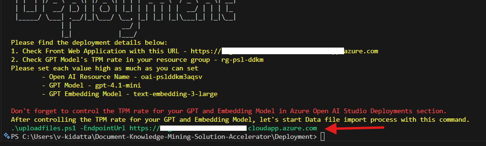

# Deployment Guide

## Overview

This guide walks you through deploying the Document Knowledge Mining Solution Accelerator to Azure. The deployment process takes approximately 8-10 minutes for the default Development/Testing configuration and includes both infrastructure provisioning and application setup.

🆘 **Need Help?** If you encounter any issues during deployment, check our [Troubleshooting Guide](./TroubleShootingSteps.md) for solutions to common problems.

## Step 1: Prerequisites & Setup

### 1.1 Azure Account Requirements

Ensure you have access to an [Azure subscription](https://azure.microsoft.com/free/) with the following permissions:

| **Required Permission/Role** | **Scope** | **Purpose** |
|------------------------------|-----------|-------------|
| **Contributor** | Subscription level | Create and manage Azure resources |
| **User Access Administrator** | Subscription level | Manage user access and role assignments |
| **Role Based Access Control** | Subscription/Resource Group level | Configure RBAC permissions |
| **App Registration Creation** | Azure Active Directory | Create and configure authentication |

**🔍 How to Check Your Permissions:**

1. Go to [Azure Portal](https://portal.azure.com/)
2. Navigate to **Subscriptions** (search for "subscriptions" in the top search bar)
3. Click on your target subscription
4. In the left menu, click **Access control (IAM)**
5. Scroll down to see the table with your assigned roles - you should see:
   - **Contributor** 
   - **User Access Administrator**
   - **Role Based Access Control Administrator** (or similar RBAC role)

**For App Registration permissions:**
1. Go to **Microsoft Entra ID** → **Manage** → **App registrations**
2. Try clicking **New registration** 
3. If you can access this page, you have the required permissions
4. Cancel without creating an app registration

📖 **Detailed Setup:** Follow [Azure Account Set Up](./AzureAccountSetUp.md) for complete configuration.

### 1.2 Check Service Availability & Quota

⚠️ **CRITICAL:** Before proceeding, ensure your chosen region has all required services available:

**Required Azure Services:**
- [Azure OpenAI Service](https://learn.microsoft.com/en-us/azure/ai-services/openai/)
- [Azure AI Search](https://learn.microsoft.com/en-us/azure/search/)
- [Azure AI Document Intelligence](https://learn.microsoft.com/en-us/azure/ai-services/document-intelligence/)
- [Azure Container Registry](https://learn.microsoft.com/en-us/azure/container-registry/)
- [Azure Kubernetes Service](https://learn.microsoft.com/en-us/azure/aks/)
- [Azure App Service](https://learn.microsoft.com/en-us/azure/app-service/)
- [Azure Blob Storage](https://learn.microsoft.com/en-us/azure/storage/blobs/)
- [Azure Queue Storage](https://learn.microsoft.com/en-us/azure/storage/queues/)
- [Azure Cosmos DB](https://learn.microsoft.com/en-us/azure/cosmos-db/)

**Recommended Regions:**  Central US, Australia East, UK South, Japan East

🔍 **Check Availability:** Use [Azure Products by Region](https://azure.microsoft.com/en-us/explore/global-infrastructure/products-by-region/) to verify service availability.

### 1.3 Quota Check (Optional)

💡 **RECOMMENDED:** Check your Azure OpenAI quota availability before deployment for optimal planning.

📖 **Follow:** [Quota Check Instructions](./QuotaCheck.md) to ensure sufficient capacity.

**Recommended Configuration:**
- **Default:** 200k tokens (minimum)
- **Optimal:** 500k tokens (recommended for best performance)

> **Note:** When you run `azd up`, the deployment will automatically show you regions with available quota, so this pre-check is optional but helpful for planning purposes. You can customize these settings later in [Step 3.3: Advanced Configuration](#33-advanced-configuration-optional).

📖 **Adjust Quota:** Follow [Azure AI Model Quota Settings](./AzureAIModelQuotaSettings.md) if needed.

## Step 2: Deployment Environment

### Local Environment

**Required Tools:**
- [PowerShell 7.0+](https://learn.microsoft.com/en-us/powershell/scripting/install/installing-powershell) 
- [Azure CLI (az) 1.18.0+](https://learn.microsoft.com/en-us/cli/azure/install-azure-cli-windows?tabs=azure-cli)
- [Azure Developer CLI (azd) 1.18.0+](https://aka.ms/install-azd)
- [Helm](https://helm.sh/docs/intro/install/)
- [Docker Desktop](https://www.docker.com/products/docker-desktop/)
- [Git](https://git-scm.com/downloads)
- [Microsoft.Compute Registration](https://learn.microsoft.com/en-us/azure/azure-resource-manager/management/resource-providers-and-types#azure-portal) 
  Ensure that **Microsoft.Compute** is registered in your Azure subscription by following these steps:
  - Log in to your **Azure Portal**.  
  - Navigate to your **active Azure subscription**.  
  - Go to **Settings** and select **Resource Providers**.
  - Check for Microsoft.Compute and click Register if it is not already registered.
  
   

**Setup Steps:**
1. Install all required deployment tools listed above
2. Clone the repository:
   ```shell
   azd init -t microsoft/Document-Knowledge-Mining-Solution-Accelerator
   ```
3. Open the project folder in your terminal
4. Proceed to [Step 3: Configure Deployment Settings](#step-3-configure-deployment-settings)

**PowerShell Users:** If you encounter script execution issues, run:
```powershell
Set-ExecutionPolicy -Scope Process -ExecutionPolicy Bypass
```

## Step 3: Configure Deployment Settings

Review the configuration options below. You can customize any settings that meet your needs, or leave them as defaults to proceed with a standard deployment.

### 3.1 Choose Deployment Type (Optional)

| **Aspect** | **Development/Testing (Default)** | **Production** |
|------------|-----------------------------------|----------------|
| **Configuration File** | `main.parameters.json` (sandbox) | Copy `main.waf.parameters.json` to `main.parameters.json` |
| **Security Controls** | Minimal (for rapid iteration) | Enhanced (production best practices) |
| **Cost** | Lower costs | Cost optimized |
| **Use Case** | POCs, development, testing | Production workloads |
| **Framework** | Basic configuration | [Well-Architected Framework](https://learn.microsoft.com/en-us/azure/well-architected/) |
| **Features** | Core functionality | Reliability, security, operational excellence |

**To use production configuration:**

Copy the contents from the production configuration file to your main parameters file:

1. Navigate to the `infra` folder in your project
2. Open `main.waf.parameters.json` in a text editor (like Notepad, VS Code, etc.)
3. Select all content (Ctrl+A) and copy it (Ctrl+C)
4. Open `main.parameters.json` in the same text editor
5. Select all existing content (Ctrl+A) and paste the copied content (Ctrl+V)
6. Save the file (Ctrl+S)

### 3.2 Set VM Credentials (Optional - Production Deployment Only)

> **Note:** This section only applies if you selected **Production** deployment type in section 3.1. VMs are not deployed in the default Development/Testing configuration.

By default, random GUIDs are generated for VM credentials. To set custom credentials:

```shell
azd env set AZURE_ENV_VM_ADMIN_USERNAME <your-username>
azd env set AZURE_ENV_VM_ADMIN_PASSWORD <your-password>
```

### 3.3 Advanced Configuration (Optional)

<details>
<summary><b>Configurable Parameters</b></summary>

You can customize various deployment settings before running `azd up`, including Azure regions, AI model configurations (deployment type, version, capacity), container registry settings, and resource names.

📖 **Complete Guide:** See [Parameter Customization Guide](./CustomizingAzdParameters.md) for the full list of available parameters and their usage.

</details>

<details>
<summary><b>Reuse Existing Resources</b></summary>

To optimize costs and integrate with your existing Azure infrastructure, you can configure the solution to reuse compatible resources already deployed in your subscription.

**Supported Resources for Reuse:**

- **Log Analytics Workspace:** Integrate with your existing monitoring infrastructure by reusing an established Log Analytics workspace for centralized logging and monitoring. [Configuration Guide](./re-use-log-analytics.md)

**Key Benefits:**
- **Cost Optimization:** Eliminate duplicate resource charges
- **Operational Consistency:** Maintain unified monitoring and AI infrastructure
- **Faster Deployment:** Skip resource creation for existing compatible services
- **Simplified Management:** Reduce the number of resources to manage and monitor

**Important Considerations:**
- Ensure existing resources meet the solution's requirements and are in compatible regions
- Review access permissions and configurations before reusing resources
- Consider the impact on existing workloads when sharing resources

</details>

## Step 4: Deploy the Solution

💡 **Before You Start:** If you encounter any issues during deployment, check our [Troubleshooting Guide](./TroubleShootingSteps.md) for common solutions.

### 4.1 Authenticate with Azure

```shell
azd auth login
```

**For specific tenants:**
```shell
azd auth login --tenant-id <tenant-id>
```

> **Finding Tenant ID:** 
   > 1. Open the [Azure Portal](https://portal.azure.com/).
   > 2. Navigate to **Microsoft Entra ID** from the left-hand menu.
   > 3. Under the **Overview** section, locate the **Tenant ID** field. Copy the value displayed.

### 4.2 Start Deployment

```shell
azd up
```

**During deployment, you'll be prompted for:**
1. **Environment name** (e.g., "dkmsa") - Must be 3-16 characters long, alphanumeric only
2. **Azure subscription** selection
3. **Azure AI Deployment Location** - Select a region with available Azure OpenAI Service quota for GPT-4.1-mini and text-embedding-3-large models
4. **Primary location** - Select the region where your infrastructure resources will be deployed
5. **Resource group** selection (create new or use existing)

**Expected Duration:** 8-10 minutes for default configuration

**⚠️ Deployment Issues:** If you encounter errors or timeouts, try a different region as there may be capacity constraints. For detailed error solutions, see our [Troubleshooting Guide](./TroubleShootingSteps.md).

## Step 5: Post Deployment Configuration
The post deployment process is very straightforward and simplified via a single [deployment script](../Deployment/resourcedeployment.ps1) that completes in approximately 20-30 minutes:

### Automated Deployment Steps:
- Configure Kubernetes Infrastructure.
- Update Kubernetes configuration files with the FQDN, Container Image Path and Email address for the certificate management.
- Configure AKS (deploy Cert Manager, Ingress Controller) and Deploy Images on the kubernetes cluster.
- Docker build and push container images to Azure Container Registry.
- Display the deployment result and following instructions.

### 5.1 Execute the Script

#### 5.1.1 Open PowerShell, change directory where you code cloned, then run the deploy script:

```shell
cd .\Deployment\
```

#### 5.1.2 Choose the appropriate command based on your deployment method:

**If you deployed using `azd up` command:**
```shell
.\resourcedeployment.ps1
```

**If you deployed using custom templates, ARM/Bicep deployments, or `az deployment group` commands:**
```shell
.\resourcedeployment.ps1 -ResourceGroupName "<your-resource-group-name>"
```

> **Note:** Replace `<your-resource-group-name>` with the actual name of the resource group containing your deployed Azure resources.

> **💡 Tip**: Since this guide is for azd deployment, you'll typically use the first command without the `-ResourceGroupName` parameter.

If you run into issue with PowerShell script file not being digitally signed, you can execute below command:

```shell
powershell.exe -ExecutionPolicy Bypass -File ".\resourcedeployment.ps1"
```

#### 5.1.3 You will be prompted for the following parameters with this Screen:


##### 5.1.3.1 **Email** - used for issuing certificates in Kubernetes clusters from the [Let's Encrypt](https://letsencrypt.org/) service. Email address should be valid.


##### 5.1.3.2 You will be prompted to login. Select an account and proceed to login.

##### 5.1.3.3 **GO!** - Post Deployment script executes Azure Infrastructure configuration, Application code compile and publish into Kubernetes Cluster.

##### 5.1.3.4 Deployment Complete

#### 🥳🎉 First, congrats on finishing Deployment!
Let's check the message and configure your model's TPM rate higher to get better performance.  
You can check the Application URL from the final console message.  
Don't miss this URL information. This is the application's endpoint URL and should be used for your data importing process.


### 5.2 Manual Deployment Steps:
**Create Content Filter** - Please follow below steps
> * Navigate to project in Azure OpenAI, then go to Azure AI Foundry, select Safety + security
> * Click on Create Content Filter and set the filters to a high threshold for the following categories:
    ```
    Hate, Sexual, Self-harm, Violence
    ```
> * Please select the checkbox of profanity
> * Leave all other configurations at their default settings and click on create

### 5.3 Configure Azure OpenAI Rate Limits

> **Capacity Note:**
> * The deployment script creates models with a setting of 1 token per minute (TPM) rate limit.
> * Faster performance can be achieved by increasing the TPM limit with Azure AI Foundry.
> * Capacity varies for [regional quota limits](https://learn.microsoft.com/en-us/azure/ai-services/openai/quotas-limits#regional-quota-limits) as well as for [provisioned throughput](https://learn.microsoft.com/en-us/azure/ai-services/openai/concepts/provisioned-throughput).
> * As a starting point, we recommend the following quota threshold be set up for this service run.

| Model Name             | TPM Threshold |
|------------------------|---------------|
| GPT-4.1-mini           | 100K TPM      |
| text-embedding-3-large | 200K TPM      |

> **⚠️ Warning:**  **Insufficient quota can cause failures during the upload process.** Please ensure you have the recommended capacity or request for additional capacity before start uploading the files.

#### 5.3.1 Browse to the project in Azure AI Foundry, and select **each of the 2 models** within the `Deployments` menu:


#### 5.3.2 Increase the TPM value for **each model** for faster report generation:


### 5.4 Data Uploading and Processing

After increasing the TPM limit for each model, let's upload and process the sample documents.

Execute this command:



### 5.5 Verify Deployment

1. Access your application using the URL from [Step 5.1.3.4](#5134-deployment-complete)
2. Confirm the application loads successfully
3. Verify you can sign in with your authenticated account

### 5.6 Test the Application

Follow the detailed workflow to test the migration functionality:

**Quick Test Steps:**
1. Login to the application using the URL from [Step 5.1.3.4](#5134-deployment-complete)
2. In "Chat with documents" options, ask any questions related to uploaded documents
3. Click on "Details" of any document and go to "chat" option
4. Ask questions according to document content
5. Review the responses

📖 **Sample Questions:** For a comprehensive list of test scenarios and example questions, see [Sample Questions Guide](./SampleQuestions.md)

## Step 6: Clean Up (Optional)

### Remove All Resources
```shell
azd down
```
> **Note:** If you deployed with `enableRedundancy=true` and Log Analytics workspace replication is enabled, you must first disable replication before running `azd down` else resource group delete will fail. Follow the steps in [Handling Log Analytics Workspace Deletion with Replication Enabled](./LogAnalyticsReplicationDisable.md), wait until replication returns `false`, then run `azd down`.

### Manual Cleanup (if needed)
If deployment fails or you need to clean up manually:
- Follow [Delete Resource Group Guide](./DeleteResourceGroup.md)

## Managing Multiple Environments

### Recover from Failed Deployment

If your deployment failed or encountered errors, here are the steps to recover:

<details>
<summary><b>Recover from Failed Deployment</b></summary>

**If your deployment failed or encountered errors:**

1. **Try a different region:** Create a new environment and select a different Azure region during deployment
2. **Clean up and retry:** Use `azd down` to remove failed resources, then `azd up` to redeploy
3. **Check troubleshooting:** Review [Troubleshooting Guide](./TroubleShootingSteps.md) for specific error solutions
4. **Fresh start:** Create a completely new environment with a different name

**Example Recovery Workflow:**
```shell
# Remove failed deployment (optional)
azd down

# Create new environment (3-16 chars, alphanumeric only)
azd env new dkmsaretry

# Deploy with different settings/region
azd up
```

</details>

### Creating a New Environment

If you need to deploy to a different region, test different configurations, or create additional environments:

<details>
<summary><b>Create a New Environment</b></summary>

**Create Environment Explicitly:**
```shell
# Create a new named environment (3-16 characters, alphanumeric only)
azd env new <new-environment-name>

# Select the new environment
azd env select <new-environment-name>

# Deploy to the new environment
azd up
```

**Example:**
```shell
# Create a new environment for production (valid: 3-16 chars)
azd env new dkmsaprod

# Switch to the new environment
azd env select dkmsaprod

# Deploy with fresh settings
azd up
```

> **Environment Name Requirements:**
> - **Length:** 3-16 characters
> - **Characters:** Alphanumeric only (letters and numbers)
> - **Valid examples:** `dkmsa`, `test123`, `myappdev`, `prod2024`
> - **Invalid examples:** `co` (too short), `my-very-long-environment-name` (too long), `test_env` (underscore not allowed), `myapp-dev` (hyphen not allowed)

</details>

<details>
<summary><b>Switch Between Environments</b></summary>

**List Available Environments:**
```shell
azd env list
```

**Switch to Different Environment:**
```shell
azd env select <environment-name>
```

**View Current Environment:**
```shell
azd env get-values
```

</details>

### Best Practices for Multiple Environments

- **Use descriptive names:** `dkmsadev`, `dkmsaprod`, `dkmsatest` (remember: 3-16 chars, alphanumeric only)
- **Different regions:** Deploy to multiple regions for testing quota availability
- **Separate configurations:** Each environment can have different parameter settings
- **Clean up unused environments:** Use `azd down` to remove environments you no longer need

## Next Steps

Now that your deployment is complete and tested, explore these resources to enhance your experience:

📚 **Learn More:**
- [Technical Architecture](./TechnicalArchitecture.md) - Understand the system design and components
- [Local Development Setup](./LocalDevelopmentSetup.md) - Set up your local development environment
- [Sample Questions](./SampleQuestions.md) - Example prompts to test the solution

## Need Help?

- 🐛 **Issues:** Check [Troubleshooting Guide](./TroubleShootingSteps.md)
- 💬 **Support:** Review [Support Guidelines](../SUPPORT.md)
- 🔧 **Development:** See [Contributing Guide](../CONTRIBUTING.md)