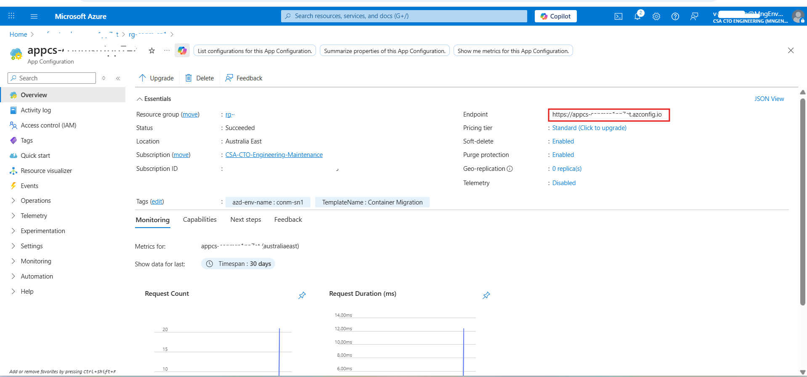

# Local Development Setup Guide

This guide provides comprehensive instructions for setting up the Document Knowledge Mining Solution Accelerator for local development across Windows, Linux, and macOS platforms.

## Important Setup Notes

### Multi-Service Architecture

This application consists of **three separate services** that run independently:

1. **Kernel Memory** - Document processing and knowledge mining service
2. **Backend API** - REST API server for the frontend
3. **Frontend** - React-based user interface

> **⚠️ Critical: Each service must run in its own terminal/console window**
>
> - **Do NOT close terminals/windows** while services are running
> - Open **Kernel Memory** and **Backend API** in Visual studio.
> - Open **Frontend** in Visual Studio Code.
> - Each service will occupy its terminal and show live logs
>
> **Terminal/Window Organization:**
> - **Visual Studio window 1**: Kernel Memory - Service runs on port 9001 
> - **Visual Studio window 2**: Backend API - HTTP server runs on port 52190
> - **Visual Studio Code Terminal**: Frontend - Development server on port 5900

### Path Conventions

**All paths in this guide are relative to the repository root directory:**

```bash
Document-Knowledge-Mining-Solution-Accelerator/        ← Repository root (start here)
├── App/
│   ├── backend-api/                            
│   │   ├── Microsoft.GS.DPS.sln                       ← Backend solution file
│   │   └── Microsoft.GS.DPS.Host/                            
│   │       └── appsettings.Development.json           ← Backend API config 
│   ├── kernel-memory/                         
│   │   ├── KernelMemory.sln                           ← Kernel Memory solution file
│   │   └── service/                        
│   │       └── Service/                     
│   │           └── appsettings.Development.json       ← Kernel Memory config 
│   └── frontend-app/                           
│       ├── src/                                       ← React/TypeScript source
│       ├── package.json                               ← Frontend dependencies
│       └── .env                                       ← Frontend config file
├── Deployment/
│   └── appconfig/                                     ← Configuration templates location
│       ├── aiservice/
│       │   └── appsettings.Development.json.template  ← Backend API template
│       ├── frontapp/
│       │   └── .env.template                          ← Frontend template
│       └── kernelmemory/
│           └── appsettings.Development.json.template  ← Kernel Memory template
├── infra/                                        
│   ├── main.bicep                                     ← Main infrastructure template
│   └── main.parameters.json                           ← Deployment parameters
└── docs/                                              ← Documentation (you are here)
```

**Before starting any step, ensure you are in the repository root directory:**

```bash
# Verify you're in the correct location
pwd  # Linux/macOS - should show: .../Document-Knowledge-Mining-Solution-Accelerator
Get-Location  # Windows PowerShell - should show: ...\Document-Knowledge-Mining-Solution-Accelerator

# If not, navigate to repository root
cd path/to/Document-Knowledge-Mining-Solution-Accelerator
```

### Configuration Files

This project uses two separate `appsettings.Development.json` files and one `.env` file with different configuration requirements:

- **Kernel Memory**: `App/kernel-memory/service/Service/appsettings.Development.json` - Azure App Configuration URL
- **Backend API**: `App/backend-api/Microsoft.GS.DPS.Host/appsettings.Development.json` - Azure App Configuration URL
- **Frontend**: `App/frontend-app/.env` - Frontend API endpoint configuration

Configuration templates are located in the `Deployment/appconfig/` directory.

## Step 1: Prerequisites Install Required Tools
Install these tools before you start:
- [Visual Studio](https://visualstudio.microsoft.com/)
- [Visual Studio Code](https://code.visualstudio.com/)

### Windows Development

#### Option 1: Native Windows (PowerShell)
```powershell
# .NET SDK (LTS .NET 8)
winget install Microsoft.DotNet.SDK.8

# Azure CLI (required for authentication and resource management)
winget install Microsoft.AzureCLI

# Yarn (via Corepack) – install Node.js LTS first
winget install OpenJS.NodeJS.LTS
corepack enable
corepack prepare yarn@stable --activate

# Verify
dotnet --version
az --version
yarn --version
```

#### Option 2: Windows with WSL2 (Recommended)

```powershell
# Install WSL2 with Ubuntu (run in PowerShell as Administrator) 
wsl --install -d Ubuntu

# Once inside Ubuntu, install .NET SDK, Azure CLI, and Node.js LTS
# (use apt or Microsoft package repos depending on preference)

# Install Azure CLI in Ubuntu
curl -sL https://aka.ms/InstallAzureCLIDeb | sudo bash

# Verify installations
dotnet --version
az --version
node -v 
yarn --version
```
### Linux Development

#### Ubuntu/Debian
```bash
# .NET SDK (LTS .NET 8)
sudo apt update && sudo apt install -y dotnet-sdk-8.0

# Azure CLI (required for authentication and resource management)
curl -sL https://aka.ms/InstallAzureCLIDeb | sudo bash

# Yarn (via Corepack) – install Node.js LTS first
sudo apt install -y nodejs npm
corepack enable
corepack prepare yarn@stable --activate

# Verify
dotnet --version
az --version
yarn --version
```

#### RHEL/CentOS/Fedora
```bash
# .NET SDK (LTS .NET 8)
sudo dnf install -y dotnet-sdk-8.0

# Azure CLI (required for authentication and resource management)
sudo rpm --import https://packages.microsoft.com/keys/microsoft.asc
sudo dnf install -y https://packages.microsoft.com/config/rhel/9.0/packages-microsoft-prod.rpm
sudo dnf install -y azure-cli

# Yarn (via Corepack) – install Node.js LTS first
sudo dnf install -y nodejs npm
corepack enable
corepack prepare yarn@stable --activate

# Verify
dotnet --version
az --version
yarn --version
```
### Clone the Repository

```bash
git clone https://github.com/microsoft/Document-Knowledge-Mining-Solution-Accelerator.git
cd Document-Knowledge-Mining-Solution-Accelerator
```

---

> **⚠️ IMPORTANT PREREQUISITE**  
> Before proceeding with local development setup, you must have **already deployed the Azure resources** for this accelerator.  
> If you haven't deployed yet, follow the [Deployment Guide](DeploymentGuide.md) first.  
> Local development requires access to deployed Azure resources (App Configuration, Storage, AI Search, OpenAI, Document Intelligence).

---

## Step 2: Azure Authentication Setup

Before configuring services, authenticate with Azure:

```bash
# Login to Azure CLI
az login

# Set your subscription
az account set --subscription "your-subscription-id"

# Verify authentication
az account show
```

### Get Azure App Configuration URL

Navigate to your resource group and select the resource with prefix `appcs-` to get the configuration URL:

```bash
APP_CONFIGURATION_URL=https://[Your app configuration service name].azconfig.io
```

For reference, see the image below:


### Required Azure RBAC Permissions

To run the application locally, your Azure account needs the following role assignments on the deployed resources:

#### App Configuration Access
```bash
# Get your principal ID
PRINCIPAL_ID=$(az ad signed-in-user show --query id -o tsv)

# Assign App Configuration Data Reader role
az role assignment create \
  --assignee $PRINCIPAL_ID \
  --role "App Configuration Data Reader" \
  --scope "/subscriptions/<subscription-id>/resourceGroups/<resource-group>/providers/Microsoft.AppConfiguration/configurationStores/<appconfig-name>"
```

#### Other Required Roles
Depending on the features you use, you may also need:

**Storage Blob Data Contributor** – For Azure Storage operations  

```bash
# Assign Storage Blob Data Contributor role
az role assignment create \
  --assignee $PRINCIPAL_ID \
  --role "Storage Blob Data Contributor" \
  --scope "/subscriptions/<subscription-id>/resourceGroups/<resource-group>/providers/Microsoft.Storage/storageAccounts/<storage-account-name>"
```

**Storage Queue Data Contributor** – For queue-based processing

```bash
# Assign Storage Queue Data Contributor role
az role assignment create \
  --assignee $PRINCIPAL_ID \
  --role "Storage Queue Data Contributor" \
  --scope "/subscriptions/<subscription-id>/resourceGroups/<resource-group>/providers/Microsoft.Storage/storageAccounts/<storage-account-name>"
```

**Search Index Data Contributor** – For Azure AI Search operations

```bash
# Assign Search Index Data Contributor role
az role assignment create \
  --assignee $PRINCIPAL_ID \
  --role "Search Index Data Contributor" \
  --scope "/subscriptions/<subscription-id>/resourceGroups/<resource-group>/providers/Microsoft.Search/searchServices/<search-service-name>"
```

**Search Service Contributor** – For managing Azure AI Search service

```bash
# Assign Search Service Contributor role
az role assignment create \
  --assignee $PRINCIPAL_ID \
  --role "Search Service Contributor" \
  --scope "/subscriptions/<subscription-id>/resourceGroups/<resource-group>/providers/Microsoft.Search/searchServices/<search-service-name>"
```

**Cognitive Services OpenAI User** – For Azure OpenAI access

```bash
# Assign Cognitive Services OpenAI User role
az role assignment create \
  --assignee $PRINCIPAL_ID \
  --role "Cognitive Services OpenAI User" \
  --scope "/subscriptions/<subscription-id>/resourceGroups/<resource-group>/providers/Microsoft.CognitiveServices/accounts/<openai-service-name>"
```

**Cognitive Services User** – For Azure AI Document Intelligence access

```bash
# Assign Cognitive Services User role
az role assignment create \
  --assignee $PRINCIPAL_ID \
  --role "Cognitive Services User" \
  --scope "/subscriptions/<subscription-id>/resourceGroups/<resource-group>/providers/Microsoft.CognitiveServices/accounts/<document-intelligence-service-name>"
```

**Note**: RBAC permission changes can take 5-10 minutes to propagate. If you encounter "Forbidden" errors after assigning roles, wait a few minutes and try again.

## Step 3: Backend Setup & Run Instructions

### 3.1. Open Solutions in Visual Studio

Navigate to the cloned repository and open the following solution files from Visual Studio:

- **KernelMemory** path: `Document-Knowledge-Mining-Solution-Accelerator/App/kernel-memory/KernelMemory.sln`

- **Microsoft.GS.DPS** path: `Document-Knowledge-Mining-Solution-Accelerator/App/backend-api/Microsoft.GS.DPS.sln`

**Sign in to Visual Studio** using your tenant account with the required permissions.

---

### 3.2. Create/Verify `appsettings.Development.json` Files

**After deploying the accelerator**, the `appsettings.Development.json` file should be created automatically. If you are using a deployed resource group that was **not deployed from your machine**, you will need to create these files manually.

#### KernelMemory Solution

1. In the **Service** project (inside the `service` folder), expand the `appsettings.json` file.
2. Confirm that `appsettings.Development.json` exists.
3. If it does not exist, create it manually by copying the template file:

```bash
# From repository root
cd "Document-Knowledge-Mining-Solution-Accelerator"

# Copy the template file
cp Deployment/appconfig/kernelmemory/appsettings.Development.json.template App/kernel-memory/service/Service/appsettings.Development.json  # Linux
# or
Copy-Item Deployment\appconfig\kernelmemory\appsettings.Development.json.template App\kernel-memory\service\Service\appsettings.Development.json   # Windows PowerShell
```

4. Edit the `appsettings.Development.json` file with your Azure App Configuration URL:

```json
{
  "ConnectionStrings": {
    "AppConfig": "https://<app-config-name>.azconfig.io"
  }
}
```
#### Microsoft.GS.DPS Solution

1. In the **Microsoft.GS.DPS.Host** project, expand the `appsettings.json` file.
2. Confirm that `appsettings.Development.json` exists.
3. If it does not exist, create it manually by copying the template file:

```bash
# From repository root
cd "Document-Knowledge-Mining-Solution-Accelerator"

# Copy the template file
cp Deployment/appconfig/aiservice/appsettings.Development.json.template App/backend-api/Microsoft.GS.DPS.Host/appsettings.Development.json  # Linux
# or
Copy-Item Deployment\appconfig\aiservice\appsettings.Development.json.template App\backend-api\Microsoft.GS.DPS.Host\appsettings.Development.json   # Windows PowerShell
```

4. Edit the `appsettings.Development.json` file with your Azure App Configuration URL:

```json
{
  "ConnectionStrings": {
    "AppConfig": "https://<app-config-name>.azconfig.io"
  }
}
```

---

### 3.3. Set Startup Projects

- **KernelMemory Solution:**  
    Set **Service** (located inside the `service` folder) as the startup project to run the Kernel Memory service.

- **Microsoft.GS.DPS Solution:**  
    Set **Microsoft.GS.DPS.Host** as the startup project to run the API.

---


### 3.4. Alternative: Assign Azure Roles via Portal (If CLI Commands Don't Work)

> **Note:**  
> If you were unable to assign roles using the Azure CLI commands in Step 2, you can use the Azure Portal as an alternative method.
> These roles are required only for local debugging and development. For production, ensure proper RBAC policies are applied.

1. Sign in to the [Azure Portal](https://portal.azure.com).
2. Navigate to your **Resource Group** where services are deployed.
3. For each resource, assign the required roles:

#### App Configuration
   - Go to **Access control (IAM)** → **Add role assignment**
   - Assign role: `App Configuration Data Reader`
   - Assign to: Your user account

#### Storage Account
   - Go to **Access control (IAM)** → **Add role assignment**
   - Assign the following roles to your user account:
     - `Storage Blob Data Contributor`
     - `Storage Queue Data Contributor`

#### Azure AI Search
   - Go to **Access control (IAM)** → **Add role assignment**
   - Assign the following roles to your user account:
     - `Search Index Data Contributor`
     - `Search Service Contributor`

#### Azure OpenAI
   - Go to **Access control (IAM)** → **Add role assignment**
   - Assign role: `Cognitive Services OpenAI User`
   - Assign to: Your user account

#### Azure AI Document Intelligence
   - Go to **Access control (IAM)** → **Add role assignment**
   - Assign role: `Cognitive Services User`
   - Assign to: Your user account

**Remember**: RBAC permission changes can take 5-10 minutes to propagate.

---

### 3.5. Update Kernel Memory Endpoint in Azure App Configuration

> **Important:**  
> The following change is only for local development and debugging.  
> For production or Azure deployment, ensure the endpoint is set to `http://kernelmemory-service` to avoid misconfiguration.

1. Sign in to the [Azure Portal](https://portal.azure.com).
2. Navigate to your **App Configuration** resource within/from your deployed resource group.
3. Go to **Operations → Configuration Explorer**.
4. Search for the key:  
     `Application:Services:KernelMemory:Endpoint`
5. For local development, update its value from:
     ```
     http://kernelmemory-service
     ```
     to
     ```
     http://localhost:9001
     ```
6. Apply the changes.

---
**After running both solutions, two terminal windows will appear. Once the backend starts successfully, Swagger will start at http://localhost:9001. You can now validate the API endpoints from the Swagger UI to ensure that the backend is running correctly.**

> **Note:**  
> Always revert the Kernel Memory endpoint value back to `http://kernelmemory-service` before running the application in Azure.

---


## Step 4: Frontend Setup & Run Instructions

### 4.1. Open the repo in **VS Code**.

### 4.2. Create `.env` file from template

Navigate to the `App/frontend-app` folder and create the `.env` file:

```bash
# From repository root
cd "Document-Knowledge-Mining-Solution-Accelerator"

# Copy the template file
cp Deployment/appconfig/frontapp/.env.template App/frontend-app/.env  # Linux
# or
Copy-Item Deployment\appconfig\frontapp\.env.template App\frontend-app\.env   # Windows PowerShell
```

### 4.3. Configure the `.env` file

Update the `VITE_API_ENDPOINT` value with your local Backend API URL:

```env
VITE_API_ENDPOINT=https://localhost:52190
DISABLE_AUTH=true
VITE_ENABLE_UPLOAD_BUTTON=true
```
### 4.4. Verify Node.js and Yarn Installation

Before installing dependencies, verify that Node.js (LTS) and Yarn are already installed from Step 1:

```powershell
# Verify installations
node -v
yarn -v
```
> **Note:** If Yarn is not installed, go back to Step 1 and complete the prerequisites, or use the below commands to install:
> ```powershell
> corepack enable
> corepack prepare yarn@stable --activate
> ```

### 4.5. Install frontend dependencies

```bash
# From repository root, navigate to frontend directory
cd App/frontend-app

# Install dependencies
yarn install
```

### 4.6. Start the application

```powershell
yarn start
```

---

**Services will be available at:**
- **Kernel Memory Service**: http://localhost:9001 
- **Backend API**: https://localhost:52190 
- **Frontend Application**: http://localhost:5900

You're now ready to run and debug the application locally!

---

## Troubleshooting

### Common Issues

#### Connection Issues

- While running the Kernel solution, if you encounter an error such as ``server not responded`` or ``server not found``, it usually indicates that the required resource is not responding.
- Ensure that the necessary **Kubernetes services** are running. If not, start the Kubernetes service and then run the Kernel solution again.

#### Permission Issues (Linux/macOS)

```bash
# Fix ownership of files
sudo chown -R $USER:$USER .
```

#### Windows-Specific Issues

```powershell
# PowerShell execution policy
Set-ExecutionPolicy -ExecutionPolicy RemoteSigned -Scope CurrentUser

# Long path support (Windows 10 1607+, run as Administrator)
New-ItemProperty -Path "HKLM:\SYSTEM\CurrentControlSet\Control\FileSystem" -Name "LongPathsEnabled" -Value 1 -PropertyType DWORD -Force
```

### Azure Authentication Issues

```bash
# Login to Azure CLI
az login

# Set subscription
az account set --subscription "your-subscription-id"

# Test authentication
az account show
```

### Environment Variable Issues

```bash
# Check environment variables are loaded
env | grep AZURE  # Linux/macOS
Get-ChildItem Env:AZURE*  # Windows PowerShell

# Validate .env file format
cat .env | grep -v '^#' | grep '='  # Should show key=value pairs
```

## Related Documentation

- [Deployment Guide](DeploymentGuide.md) - Instructions for production deployment.
- [Delete Resource Group](DeleteResourceGroup.md) - Steps to safely delete the Azure resource group created for the solution.
- [PowerShell Setup](PowershellSetup.md) - Instructions for setting up PowerShell and required scripts.
- [Quota Check](QuotaCheck.md) - Steps to verify Azure quotas and ensure required limits before deployment.