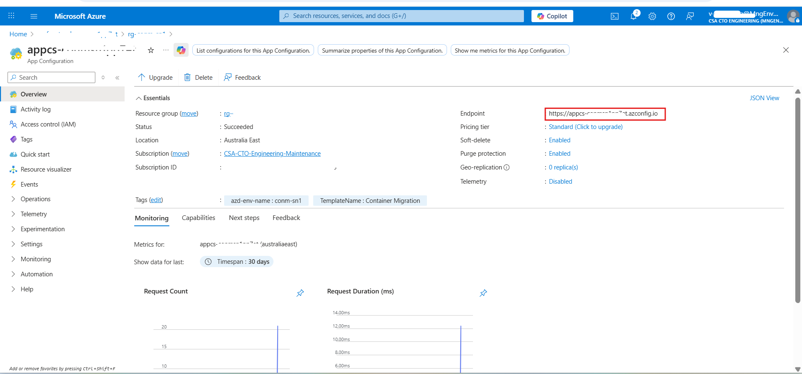

# Local Development Setup Guide

This guide provides comprehensive instructions for setting up the Document Knowledge Mining Solution Accelerator for local development on Windows.

## Important Setup Notes

### Multi-Service Architecture

This application consists of **three separate services** that run independently:

1. **Kernel Memory** - Document processing and knowledge mining service
2. **Backend API** - REST API server for the frontend
3. **Frontend** - React-based user interface

> **⚠️ Critical: Each service must run in its own terminal/console window**
>
> - **Do NOT close terminals/windows** while services are running
> - You can use **Visual Studio** or **dotnet CLI** (from VS Code terminal / PowerShell) for the backend services.
> - Open **Frontend** in Visual Studio Code.
> - Each service will occupy its terminal and show live logs
>
> **Terminal/Window Organization:**
> - **Terminal 1**: Kernel Memory - Service runs on port 9001 
> - **Terminal 2**: Backend API - HTTP server runs on port 5000
> - **Terminal 3 (VS Code)**: Frontend - Development server on port 5900

### Path Conventions

**All paths in this guide are relative to the repository root directory:**

```bash
Document-Knowledge-Mining-Solution-Accelerator/        ← Repository root (start here)
├── App/
│   ├── backend-api/                            
│   │   ├── Microsoft.GS.DPS.sln                       ← Backend solution file
│   │   └── Microsoft.GS.DPS.Host/                            
│   │       └── appsettings.Development.json           ← Backend API config 
│   ├── kernel-memory/                         
│   │   ├── KernelMemory.sln                           ← Kernel Memory solution file
│   │   └── service/                        
│   │       └── Service/                     
│   │           └── appsettings.Development.json       ← Kernel Memory config 
│   └── frontend-app/                           
│       ├── src/                                       ← React/TypeScript source
│       ├── package.json                               ← Frontend dependencies
│       └── .env                                       ← Frontend config file
├── Deployment/
│   └── appconfig/                                     ← Configuration templates location
│       ├── aiservice/
│       │   └── appsettings.Development.json.template  ← Backend API template
│       ├── frontapp/
│       │   └── .env.template                          ← Frontend template
│       └── kernelmemory/
│           └── appsettings.Development.json.template  ← Kernel Memory template
├── infra/                                        
│   ├── main.bicep                                     ← Main infrastructure template
│   └── main.parameters.json                           ← Deployment parameters
└── docs/                                              ← Documentation (you are here)
```

**Before starting any step, ensure you are in the repository root directory:**

```bash
# Verify you're in the correct location
Get-Location  # Windows PowerShell - should show: ...\Document-Knowledge-Mining-Solution-Accelerator

# If not, navigate to repository root
cd path\to\Document-Knowledge-Mining-Solution-Accelerator
```

### Configuration Files

This project uses two separate `appsettings.Development.json` files and one `.env` file with different configuration requirements:

- **Kernel Memory**: `App/kernel-memory/service/Service/appsettings.Development.json` - Azure App Configuration URL
- **Backend API**: `App/backend-api/Microsoft.GS.DPS.Host/appsettings.Development.json` - Azure App Configuration URL
- **Frontend**: `App/frontend-app/.env` - Frontend API endpoint configuration

Configuration templates are located in the `Deployment/appconfig/` directory.

## Step 1: Azure Deployment Prerequisite

> **⚠️ Critical: You must have a deployed Azure environment before proceeding.**
>
> This local development guide requires a working Azure deployment of the solution accelerator. The backend services connect to Azure App Configuration, Azure OpenAI, Azure AI Search, Azure Storage, and other Azure resources at runtime.

Choose the scenario that matches your situation:

#### Scenario A: You already have an existing resource group with deployed resources

If someone on your team has already deployed the solution (or you deployed it previously), you can reuse that resource group. You just need to:

1. Get the **resource group name** from your team or from the [Azure Portal](https://portal.azure.com) → **Resource groups**.
2. Verify the App Configuration resource exists in that resource group:
   ```powershell
   # List App Configuration resources in your resource group
   az appconfig list --resource-group "<your-resource-group-name>" --query "[].{name:name, endpoint:endpoint}" -o table
   ```
3. If the command returns an endpoint (e.g., `https://appcs-xxxxx.azconfig.io`), you're good — skip to [Step 2](#step-2-prerequisites-install-required-tools).
4. If it returns empty or errors, the deployment may be incomplete — follow Scenario B below.

> **Note:** When using an existing resource group that was **not deployed from your machine**, the `appsettings.Development.json` files will not be auto-generated. You will need to create them manually in [Step 4.2](#42-createverify-appsettingsdevelopmentjson-files) using the template files.

#### Scenario B: You need to deploy from scratch

1. Follow the [Deployment Guide](DeploymentGuide.md) to deploy the infrastructure using `azd up`
2. Complete the post-deployment steps in the Deployment Guide
3. Then return here to set up local development

#### Scenario C: Your previous deployment was deleted

If the resource group or App Configuration resource no longer exists, you must re-deploy using the [Deployment Guide](DeploymentGuide.md) before local development will work.

## Step 2: Prerequisites Install Required Tools
Install these tools before you start:
- [Visual Studio](https://visualstudio.microsoft.com/)
- [Visual Studio Code](https://code.visualstudio.com/)

### Windows Development

#### Option 1: Native Windows (PowerShell)
```powershell
# .NET SDK 8 or higher (the projects target net8.0; .NET 9+ SDK is also compatible)
winget install Microsoft.DotNet.SDK.8

# Azure CLI (required for authentication and resource management)
winget install Microsoft.AzureCLI

# Yarn (via Corepack) – install Node.js LTS first
winget install OpenJS.NodeJS.LTS
corepack enable
corepack prepare yarn@stable --activate

# Verify
dotnet --version   # Should be 8.x or higher
az --version
yarn --version
```

#### Option 2: Windows with WSL2 (Recommended)

```powershell
# Install WSL2 with Ubuntu (run in PowerShell as Administrator) 
wsl --install -d Ubuntu

# Once inside Ubuntu, install .NET SDK, Azure CLI, and Node.js LTS
# (use apt or Microsoft package repos depending on preference)

# Install Azure CLI in Ubuntu
curl -sL https://aka.ms/InstallAzureCLIDeb | sudo bash

# Verify installations
dotnet --version
az --version
node -v 
yarn --version
```
### Clone the Repository

```bash
git clone https://github.com/microsoft/Document-Knowledge-Mining-Solution-Accelerator.git
cd Document-Knowledge-Mining-Solution-Accelerator
```

---

## Step 3: Azure Authentication Setup

Before configuring services, authenticate with Azure:

```bash
# Login to Azure CLI
az login

# Set your subscription
az account set --subscription "your-subscription-id"

# Verify authentication
az account show
```

### Get Azure App Configuration URL

You can get the App Configuration URL using **Azure CLI** (recommended) or the **Azure Portal**.

#### Option 1: Using Azure CLI (recommended)

```powershell
# If you know your resource group name:
az appconfig list --resource-group "<your-resource-group-name>" --query "[].endpoint" -o tsv

# If you don't know the resource group name, list all App Configuration resources in your subscription:
az appconfig list --query "[].{name:name, endpoint:endpoint, resourceGroup:resourceGroup}" -o table
```

Copy the endpoint URL from the output (e.g., `https://appcs-xxxxx.azconfig.io`).

#### Option 2: Using Azure Portal

Navigate to your resource group and select the resource with prefix `appcs-` to get the configuration URL:

```bash
APP_CONFIGURATION_URL=https://[Your app configuration service name].azconfig.io
```

For reference, see the image below:


> **⚠️ Validate the URL is reachable** before proceeding. Run the following command to confirm the App Configuration resource exists:
> ```powershell
> # Test DNS resolution (should return an IP address, not an error)
> Resolve-DnsName "[Your app configuration service name].azconfig.io"
> ```
> If the hostname does not resolve or the resource is not found, your Azure deployment may have been deleted. Follow the [Deployment Guide](DeploymentGuide.md) to re-deploy the infrastructure before continuing.

### Required Azure RBAC Permissions

To run the application locally, your Azure account needs the following role assignments on the deployed resources:

> **Note:**  
> These roles are required only for local debugging and development. For production, ensure proper RBAC policies are applied.

You can assign these roles using either Azure CLI (Option 1) or Azure Portal (Option 2).

#### Option 1: Assign Roles via Azure CLI

```bash
# Get your principal ID
PRINCIPAL_ID=$(az ad signed-in-user show --query id -o tsv)
```

**App Configuration Data Reader** – Required for reading application configuration

```bash
# Assign App Configuration Data Reader role
az role assignment create \
  --assignee $PRINCIPAL_ID \
  --role "App Configuration Data Reader" \
  --scope "/subscriptions/<subscription-id>/resourceGroups/<resource-group>/providers/Microsoft.AppConfiguration/configurationStores/<appconfig-name>"
```

#### Other Required Roles

> **⚠️ Important:** All roles listed below are **required** for the application to function locally. Without them, the backend services will fail at runtime with `403 Forbidden` errors when accessing Azure resources.

**Storage Blob Data Contributor** – For Azure Storage operations  

```bash
# Assign Storage Blob Data Contributor role
az role assignment create \
  --assignee $PRINCIPAL_ID \
  --role "Storage Blob Data Contributor" \
  --scope "/subscriptions/<subscription-id>/resourceGroups/<resource-group>/providers/Microsoft.Storage/storageAccounts/<storage-account-name>"
```

**Storage Queue Data Contributor** – For queue-based processing

```bash
# Assign Storage Queue Data Contributor role
az role assignment create \
  --assignee $PRINCIPAL_ID \
  --role "Storage Queue Data Contributor" \
  --scope "/subscriptions/<subscription-id>/resourceGroups/<resource-group>/providers/Microsoft.Storage/storageAccounts/<storage-account-name>"
```

**Search Index Data Contributor** – For Azure AI Search operations

```bash
# Assign Search Index Data Contributor role
az role assignment create \
  --assignee $PRINCIPAL_ID \
  --role "Search Index Data Contributor" \
  --scope "/subscriptions/<subscription-id>/resourceGroups/<resource-group>/providers/Microsoft.Search/searchServices/<search-service-name>"
```

**Search Service Contributor** – For managing Azure AI Search service

```bash
# Assign Search Service Contributor role
az role assignment create \
  --assignee $PRINCIPAL_ID \
  --role "Search Service Contributor" \
  --scope "/subscriptions/<subscription-id>/resourceGroups/<resource-group>/providers/Microsoft.Search/searchServices/<search-service-name>"
```

**Cognitive Services OpenAI User** – For Azure OpenAI access

```bash
# Assign Cognitive Services OpenAI User role
az role assignment create \
  --assignee $PRINCIPAL_ID \
  --role "Cognitive Services OpenAI User" \
  --scope "/subscriptions/<subscription-id>/resourceGroups/<resource-group>/providers/Microsoft.CognitiveServices/accounts/<openai-service-name>"
```

**Cognitive Services User** – For Azure AI Document Intelligence access

```bash
# Assign Cognitive Services User role
az role assignment create \
  --assignee $PRINCIPAL_ID \
  --role "Cognitive Services User" \
  --scope "/subscriptions/<subscription-id>/resourceGroups/<resource-group>/providers/Microsoft.CognitiveServices/accounts/<document-intelligence-service-name>"
```

#### Option 2: Assign Roles via Azure Portal

If you prefer or need to use the Azure Portal instead of CLI commands:

1. Sign in to the [Azure Portal](https://portal.azure.com).
2. Navigate to your **Resource Group** where services are deployed.
3. For each resource, assign the required roles:

**App Configuration**
   - Go to **Access control (IAM)** → **Add role assignment**
   - Assign role: `App Configuration Data Reader`
   - Assign to: Your user account

**Storage Account**
   - Go to **Access control (IAM)** → **Add role assignment**
   - Assign the following roles to your user account:
     - `Storage Blob Data Contributor`
     - `Storage Queue Data Contributor`

**Azure AI Search**
   - Go to **Access control (IAM)** → **Add role assignment**
   - Assign the following roles to your user account:
     - `Search Index Data Contributor`
     - `Search Service Contributor`

**Azure OpenAI**
   - Go to **Access control (IAM)** → **Add role assignment**
   - Assign role: `Cognitive Services OpenAI User`
   - Assign to: Your user account

**Azure AI Document Intelligence**
   - Go to **Access control (IAM)** → **Add role assignment**
   - Assign role: `Cognitive Services User`
   - Assign to: Your user account

**Note**: RBAC permission changes can take 5-10 minutes to propagate. If you encounter "Forbidden" errors after assigning roles, wait a few minutes and try again.

#### Verify RBAC Assignments

After assigning roles, verify they are correctly applied:

```powershell
# Get your principal ID
$PRINCIPAL_ID = az ad signed-in-user show --query id -o tsv

# List all role assignments for your account (use --all to include resource-scoped assignments)
az role assignment list --assignee $PRINCIPAL_ID --all --query "[].roleDefinitionName" -o table
```

> **Note:** The `--all` flag is required because the roles are assigned to individual resources (Storage, Search, etc.), not to the resource group itself. Without `--all`, the command may return empty results even when roles are correctly assigned.

You should see all the roles listed above in the output. If any are missing, re-run the corresponding assignment command.

## Step 4: Backend Setup & Run Instructions

You can run the backend services using either **Visual Studio** (Option A) or the **dotnet CLI** from a terminal (Option B).

### 4.1. Open Solutions

#### Option A: Visual Studio

Navigate to the cloned repository and open the following solution files from Visual Studio:

- **KernelMemory** path: `Document-Knowledge-Mining-Solution-Accelerator/App/kernel-memory/KernelMemory.sln`

- **Microsoft.GS.DPS** path: `Document-Knowledge-Mining-Solution-Accelerator/App/backend-api/Microsoft.GS.DPS.sln`

**Sign in to Visual Studio** using your tenant account with the required permissions.

> **⚠️ Important: KernelMemory.sln build issue**  
> The `KernelMemory.sln` solution file references example and evaluation projects (`examples/`, `applications/`) that are **not included** in this repository. Building the full solution will produce errors.  
> **Workaround:** In Visual Studio, right-click the **Service** project (inside the `service` folder) → **Set as Startup Project**. Visual Studio will only build the Service project and its dependencies when you press F5.

#### Option B: dotnet CLI (VS Code / PowerShell)

No solution file is needed. You will run individual projects directly using `dotnet run`. See Step 5.3 for the CLI commands.

---

### 4.2. Create/Verify `appsettings.Development.json` Files

**After deploying the accelerator**, the `appsettings.Development.json` file should be created automatically. If you are using a deployed resource group that was **not deployed from your machine**, you will need to create these files manually.

> **⚠️ Important: If you re-deployed to a new resource group**, the config files from a previous deployment may still exist but contain a **stale App Configuration URL** that no longer resolves. Always verify the `ConnectionStrings:AppConfig` value in both `appsettings.Development.json` files matches your **current** App Configuration endpoint (from [Step 3](#get-azure-app-configuration-url)). A mismatched URL will cause a `No such host is known` error at startup.

#### KernelMemory Solution

1. In the **Service** project (inside the `service` folder), expand the `appsettings.json` file.
2. Confirm that `appsettings.Development.json` exists.
3. If it does not exist, create it manually by copying the **full template file** (not just the minimal snippet):

```powershell
# From repository root
Copy-Item Deployment\appconfig\kernelmemory\appsettings.Development.json.template App\kernel-memory\service\Service\appsettings.Development.json
```

4. Open `App\kernel-memory\service\Service\appsettings.Development.json` and replace `{{ appconfig-url }}` with your actual Azure App Configuration URL (e.g., `https://appcs-xxxxx.azconfig.io`).

> **⚠️ Important:** The template file contains the **full configuration** including handler definitions, pipeline settings, and storage types. Do **not** replace the entire file with just the minimal JSON snippet below — only update the `AppConfig` value. The minimal structure for reference:
> ```json
> {
>   "ConnectionStrings": {
>     "AppConfig": "https://your-appconfig-name.azconfig.io"
>   }
> }
> ```

#### Microsoft.GS.DPS Solution

1. In the **Microsoft.GS.DPS.Host** project, expand the `appsettings.json` file.
2. Confirm that `appsettings.Development.json` exists.
3. If it does not exist, create it manually by copying the template file:

```powershell
# From repository root
Copy-Item Deployment\appconfig\aiservice\appsettings.Development.json.template App\backend-api\Microsoft.GS.DPS.Host\appsettings.Development.json
```

4. Open `App\backend-api\Microsoft.GS.DPS.Host\appsettings.Development.json` and replace `{{ appconfig-url }}` with your actual Azure App Configuration URL (e.g., `https://appcs-xxxxx.azconfig.io`).

---

## Step 5: Run Backend Services

### 5.1. Set Startup Projects (Visual Studio only)

- **KernelMemory Solution:**  
    Right-click **Service** (located inside the `service` folder) → **Set as Startup Project**. This ensures only the Service project and its dependencies are built, avoiding errors from missing example projects in the solution.

- **Microsoft.GS.DPS Solution:**  
    Right-click **Microsoft.GS.DPS.Host** → **Set as Startup Project**.

### 5.2. Update Kernel Memory Endpoint in Azure App Configuration

> **Important:**  
> The following change is only for local development and debugging.  
> For production or Azure deployment, ensure the endpoint is set to `http://kernelmemory-service` to avoid misconfiguration.

> **Note:** This step requires a valid, reachable Azure App Configuration resource. If your App Configuration was deleted or you haven't deployed yet, complete the [Deployment Guide](DeploymentGuide.md) first.

#### Option 1: Using Azure CLI (recommended)

```powershell
# Update the Kernel Memory endpoint to localhost for local development
az appconfig kv set --name "<appconfig-name>" --key "Application:Services:KernelMemory:Endpoint" --value "http://localhost:9001" --yes

# Verify the change
az appconfig kv show --name "<appconfig-name>" --key "Application:Services:KernelMemory:Endpoint" --query "value" -o tsv
```

Replace `<appconfig-name>` with your App Configuration resource name (e.g., `appcs-xxxxx`).

#### Option 2: Using Azure Portal

1. Sign in to the [Azure Portal](https://portal.azure.com).
2. Navigate to your **App Configuration** resource within/from your deployed resource group.
3. Go to **Operations → Configuration Explorer**.
4. Search for the key:  
     `Application:Services:KernelMemory:Endpoint`
5. For local development, update its value from:
     ```
     http://kernelmemory-service
     ```
     to
     ```
     http://localhost:9001
     ```
6. Apply the changes.

> **Note:**  
> Always revert the Kernel Memory endpoint value back to `http://kernelmemory-service` before running the application in Azure.
> ```powershell
> # Revert to production value
> az appconfig kv set --name "<appconfig-name>" --key "Application:Services:KernelMemory:Endpoint" --value "http://kernelmemory-service" --yes
> ```

### 5.3. Run the Backend Services

#### Option A: Visual Studio

1. In Visual Studio, run both solutions (KernelMemory and Microsoft.GS.DPS) by pressing **F5** or clicking the **Start** button.
2. Two terminal windows will appear showing the service logs.

#### Option B: dotnet CLI (VS Code / PowerShell)

> **⚠️ Critical:** You must set the `ASPNETCORE_ENVIRONMENT` environment variable to `Development` before running.
> Without this, the `appsettings.Development.json` file will **not** be loaded, and the application will fail with a `NullReferenceException` because the App Configuration URL is not found.

Open **two separate terminals** and run one service in each:

**Terminal 1 – Kernel Memory Service:**
```powershell
# Ensure you are in the repository root directory
cd "path\to\Document-Knowledge-Mining-Solution-Accelerator"

$env:ASPNETCORE_ENVIRONMENT = "Development"
dotnet run --project App\kernel-memory\service\Service\Service.csproj --configuration Debug
```

**Terminal 2 – Backend API:**
```powershell
# Ensure you are in the repository root directory
cd "path\to\Document-Knowledge-Mining-Solution-Accelerator"

$env:ASPNETCORE_ENVIRONMENT = "Development"
$env:ASPNETCORE_URLS = "http://localhost:5000"
dotnet run --project App\backend-api\Microsoft.GS.DPS.Host\Microsoft.GS.DPS.Host.csproj --configuration Debug
```

> **Note:** The `ASPNETCORE_URLS` environment variable explicitly sets the Backend API to listen on port 5000. Without this, the default port may vary depending on your .NET SDK version (e.g., .NET 8+ defaults to port 5000 for HTTP, but this ensures consistency).

> **Note:** Do **not** build the full `KernelMemory.sln` from CLI (`dotnet build KernelMemory.sln`). It will fail because the solution references example projects that are not in this repository. Always use `--project` to target the Service project directly.

#### Verify Services

Once both services start successfully:
   - **Kernel Memory Service** will be available at: http://localhost:9001
   - **Backend API** will be available at: http://localhost:5000
   - **Swagger UI** will be available at: http://localhost:5000 for API validation

> **⚠️ Important:** Keep both terminal windows open while the services are running. Do not close them until you're done with development.

---

## Step 6: Frontend Setup & Run Instructions

### 6.1. Open the repo in **VS Code**.

### 6.2. Create `.env` file from template

Navigate to the `App/frontend-app` folder and create the `.env` file:

```bash
# From repository root
cd "Document-Knowledge-Mining-Solution-Accelerator"

# Copy the template file
Copy-Item Deployment\appconfig\frontapp\.env.template App\frontend-app\.env
```

### 6.3. Configure the `.env` file

Update the `VITE_API_ENDPOINT` value with your local Backend API URL:

```env
VITE_API_ENDPOINT=http://localhost:5000
DISABLE_AUTH=true
VITE_ENABLE_UPLOAD_BUTTON=true
```

> **Note:** The Backend API runs on **`http://localhost:5000`** by default (HTTP, not HTTPS).

**Environment variable explanation:**
| Variable | Description |
|----------|-------------|
| `VITE_API_ENDPOINT` | URL of the Backend API. Use `http://localhost:5000` for local development. |
| `DISABLE_AUTH` | Set to `true` to skip Azure AD authentication during local development. Set to `false` (or remove) when testing with authentication enabled. |
| `VITE_ENABLE_UPLOAD_BUTTON` | Set to `true` to show the document upload button in the UI. |
### 6.4. Verify Node.js and Yarn Installation

Before installing dependencies, verify that Node.js (LTS) and Yarn are already installed from Step 2:

```powershell
# Verify installations
node -v
yarn -v
```
> **Note:** If Yarn is not installed, go back to Step 2 and complete the prerequisites, or use the below commands to install:
> ```powershell
> corepack enable
> corepack prepare yarn@stable --activate
> ```

### 6.5. Install frontend dependencies

```powershell
# From repository root, navigate to frontend directory
cd App\frontend-app

# Install dependencies
yarn install
```

### 6.6. Start the application

> **Note:** The `yarn start` command must be run from the `App/frontend-app/` directory where `package.json` is located. Running it from the repository root will fail with a "Couldn't find a package.json" error. If you followed Step 6.5, you should already be in the correct directory.

```powershell
# If you are not already in App\frontend-app, navigate there first:
# cd App\frontend-app

yarn start
```

---

**Services will be available at:**
- **Kernel Memory Service**: http://localhost:9001 
- **Backend API**: http://localhost:5000 
- **Frontend Application**: http://localhost:5900

You're now ready to run and debug the application locally!

---

## Troubleshooting

### Common Issues

#### `NullReferenceException` or `ArgumentNullException: Value cannot be null (Parameter 'uriString')` on startup

This means `appsettings.Development.json` is not being loaded. Ensure:
1. The `ASPNETCORE_ENVIRONMENT` environment variable is set to `Development` (see Step 5.3).
2. The `appsettings.Development.json` file exists in the correct project directory (see Step 4.2).
3. The `ConnectionStrings:AppConfig` value contains your actual Azure App Configuration URL, not the placeholder.

#### `KernelMemory.sln` build fails with "project file was not found" errors

The solution references example projects not included in this repository. **Do not build the full solution.** Instead:
- In Visual Studio: Set **Service** as the startup project and press F5.
- In CLI: Use `dotnet run --project App\kernel-memory\service\Service\Service.csproj`.

#### `No such host is known` or DNS Resolution Failures

If the service crashes at startup with an error like:
```
No such host is known. (appcs-xxxxx.azconfig.io:443)
```

This means the Azure App Configuration resource cannot be reached. Possible causes:
1. **The Azure deployment was deleted** — The resource group or App Configuration resource no longer exists. Re-deploy using the [Deployment Guide](DeploymentGuide.md).
2. **Wrong URL** — Verify the `ConnectionStrings:AppConfig` value in your `appsettings.Development.json` matches an existing App Configuration resource.
3. **Network/VPN issues** — If behind a corporate firewall or VPN, ensure `*.azconfig.io` is accessible.

**To diagnose:**
```powershell
# Test if the hostname resolves
Resolve-DnsName "your-appconfig-name.azconfig.io"

# Verify the resource exists in Azure
az appconfig list --query "[].{name:name, endpoint:endpoint}" -o table
```

#### Connection Issues

- While running the Kernel solution, if you encounter an error such as ``server not responded`` or ``server not found``, it usually indicates that the required resource is not responding.
- Ensure that the necessary **Kubernetes services** are running. If not, start the Kubernetes service and then run the Kernel solution again.

#### Windows-Specific Issues

```powershell
# PowerShell execution policy
Set-ExecutionPolicy -ExecutionPolicy RemoteSigned -Scope CurrentUser

# Long path support (Windows 10 1607+, run as Administrator)
New-ItemProperty -Path "HKLM:\SYSTEM\CurrentControlSet\Control\FileSystem" -Name "LongPathsEnabled" -Value 1 -PropertyType DWORD -Force
```

### Azure Authentication Issues

```bash
# Login to Azure CLI
az login

# Set subscription
az account set --subscription "your-subscription-id"

# Test authentication
az account show
```

### Environment Variable Issues

```powershell
# Check environment variables are loaded
Get-ChildItem Env:AZURE*  # Windows PowerShell

# Check ASPNETCORE_ENVIRONMENT is set
$env:ASPNETCORE_ENVIRONMENT  # Should output: Development

# Validate .env file format (PowerShell)
Get-Content App\frontend-app\.env | Where-Object { $_ -notmatch '^#' -and $_ -match '=' }
```

### Prerequisites Validation Checklist

Run these commands to verify your environment is ready before starting the services:

```powershell
# 1. Verify tools are installed
Write-Host "--- Tools ---"
dotnet --version          # Should be 8.x or higher
az --version | Select-Object -First 1  # Azure CLI
node -v                   # Node.js LTS
yarn -v                   # Yarn

# 2. Verify Azure authentication
Write-Host "`n--- Azure Auth ---"
az account show --query "{subscription:name, tenant:tenantId}" -o table

# 3. Verify App Configuration is reachable
Write-Host "`n--- App Configuration ---"
$appConfigUrl = (Get-Content App\kernel-memory\service\Service\appsettings.Development.json | ConvertFrom-Json).ConnectionStrings.AppConfig
Write-Host "App Config URL: $appConfigUrl"
$hostname = ([System.Uri]$appConfigUrl).Host
Resolve-DnsName $hostname -ErrorAction SilentlyContinue | Select-Object -First 1
if ($?) { Write-Host "DNS resolution: OK" -ForegroundColor Green } else { Write-Host "DNS resolution: FAILED - Re-deploy using DeploymentGuide.md" -ForegroundColor Red }

# 4. Verify config files exist
Write-Host "`n--- Config Files ---"
@(
  "App\kernel-memory\service\Service\appsettings.Development.json",
  "App\backend-api\Microsoft.GS.DPS.Host\appsettings.Development.json",
  "App\frontend-app\.env"
) | ForEach-Object {
  $exists = Test-Path $_
  $status = if ($exists) { "EXISTS" } else { "MISSING" }
  Write-Host "  $status : $_" -ForegroundColor $(if ($exists) { 'Green' } else { 'Red' })
}
```

All items should show green. If the App Configuration DNS resolution fails, follow the [Deployment Guide](DeploymentGuide.md) to deploy or re-deploy the Azure infrastructure.

## Related Documentation

- [Deployment Guide](DeploymentGuide.md) - Instructions for production deployment.
- [Delete Resource Group](DeleteResourceGroup.md) - Steps to safely delete the Azure resource group created for the solution.
- [PowerShell Setup](PowershellSetup.md) - Instructions for setting up PowerShell and required scripts.
- [Quota Check](QuotaCheck.md) - Steps to verify Azure quotas and ensure required limits before deployment.