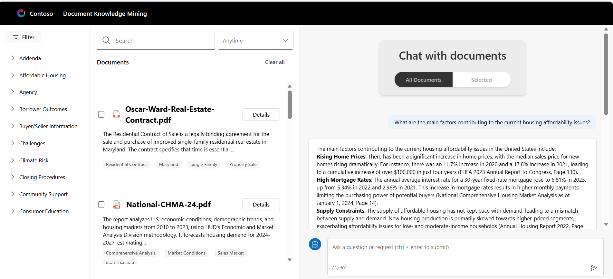

# Sample Questions

## 1. Launch Web Experience
- Open the web experience interface.
- Navigate to the **document list**.
- Scroll and page through the list to explore available documents.
- Ask in chat: **“What are the main factors contributing to the current housing affordability issues?”**

- Review the AI response for relevant insights.
- Click one of the **suggested follow-up questions** and check the response.
- Reset the chat by clicking **[New topic]**.
---

## 2. Housing Report Search & Comparison
- Search for: **“Housing Report”**.
- Observe the filtered list of documents.
- Select **Annual Housing Report 2022** and **Annual Housing Report 2023**.
  - Confirm the top panel shows **“2 Selected”**.
- Ask in chat: **“Analyze the two annual reports and compare the positive and negative outcomes YoY. Show the results in a table.”**
- Review the generated table for clarity and accuracy.

---

## 3. Detailed Review of Annual Housing Report 2023
- Click **DETAILS** on **Annual Housing Report 2023**.
- Review the **Extractive Summary** for accuracy.
- Scroll to **pages 10 & 11**.
- In the pop-up chat, ask:  
  **“Can you summarize and compare the tables on page 10 and 11?”**
- Review the summarized comparison.
- Close the pop-up viewer.

---

## 4. Contracts Search & Analysis
- Search for: **“Contracts”**.
- Observe the filtered list of documents.
- Select **3–4 handwritten contract documents**.
- Ask in chat:  
  **“Analyze these forms and create a table with all buyers, sellers, and corresponding purchase prices.”**
- Review the table for correct buyer/seller names and purchase prices.

---

## 5. Contract Details & Liabilities
- Click **DETAILS** on one of the handwritten contracts.
- In the pop-up chat, ask:  
  **“What liabilities is the buyer responsible for within the contract?”**
- Review the response for specific obligations (e.g., fees, taxes, maintenance, contingencies).

---
