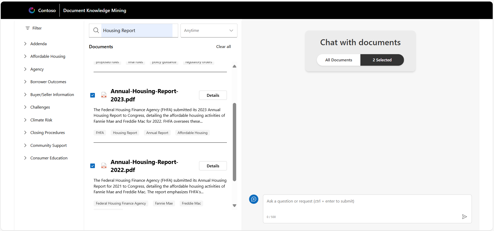

# Sample Questions

To help you get started, here are some **Sample Prompts** you can test in the application:

## **1. Housing Affordability & Report Analysis**
Prompts focus on housing issues, document filtering, and comparing annual report outcomes.

### **Overview**

**Sample Workflow:**

1. Open the web experience interface
2. Navigate to the **document list** and browse available documents
3. Ask in chat: **"What are the main factors contributing to the current housing affordability issues?"**

4. Review the AI response for relevant insights
5. Click one of the **suggested follow-up questions** and check the response
6. Reset the chat by clicking **[New topic]**

---

## **2. Housing Report Search & Comparison**
Explore key findings, compare annual data, and review detailed housing insights.

**Sample Workflow:**

1. Search for: **"Housing Report"** to filter the document list
2. Select **Annual Housing Report 2022** and **Annual Housing Report 2023**
   - Confirm the top panel shows **"2 Selected"**

3. Ask in chat: **"Analyze the two annual reports and compare the positive and negative outcomes YoY. Show the results in a table."**
4. Review the generated table for clarity and accuracy
5. Click **DETAILS** on **Annual Housing Report 2023**
6. Review the **Extractive Summary** for accuracy
7. Scroll to **pages 10 & 11**
8. Click on **Chat** tab in the pop-up viewer
9. Ask: **"Can you summarize and compare the tables on page 10 and 11?"**
10. Review the summarized comparison
11. Close the pop-up viewer

---

## **3. Contracts Search & Analysis**
Review, analyze, and extract key details from handwritten contract documents.

**Sample Workflow:**

1. Search for: **"Contracts"** to filter the document list
2. Select **3–4 handwritten contract documents**
3. Ask in chat: **"Analyze these forms and create a table with all buyers, sellers, and corresponding purchase prices."**
4. Review the table for correct buyer/seller names and purchase prices
5. Click **DETAILS** on one of the handwritten contracts
6. Click on **Chat** tab in the pop-up viewer
7. Ask: **"What liabilities is the buyer responsible for within the contract?"**
8. Review the response for specific obligations (e.g., fees, taxes, maintenance, contingencies)

---

## Summary

These workflows demonstrate how the solution enables faster insight discovery and smarter data analysis through automated content extraction and chat-based guidance.
